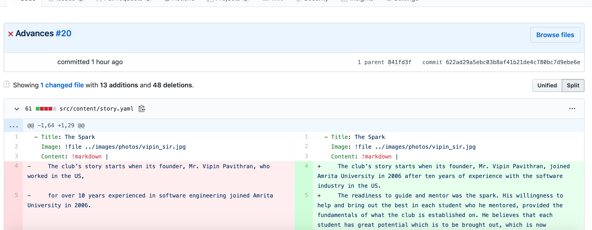
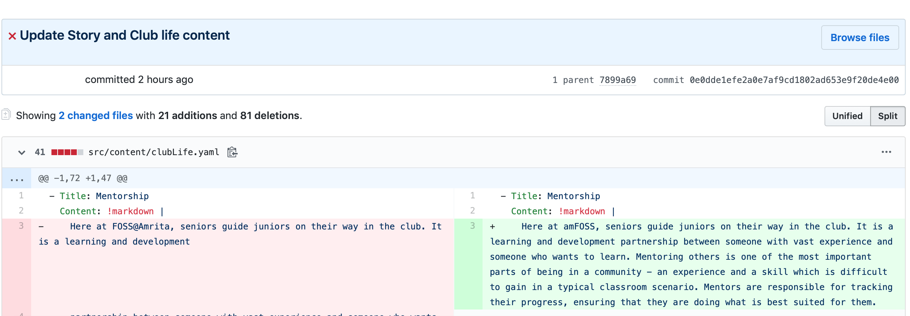
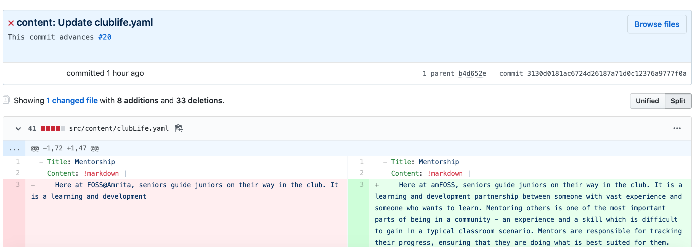
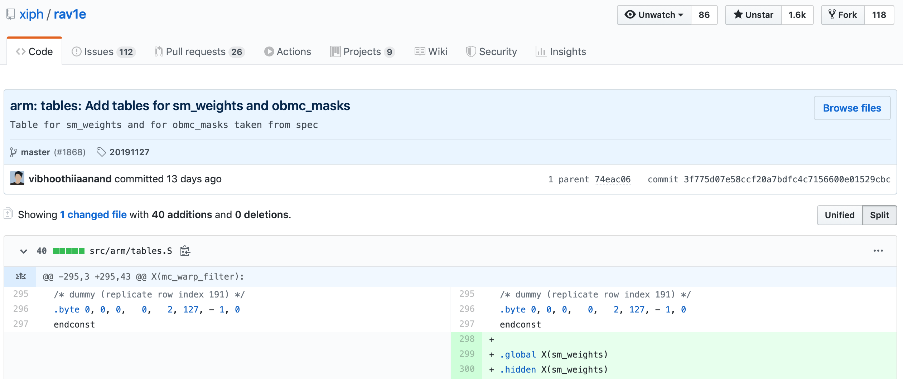
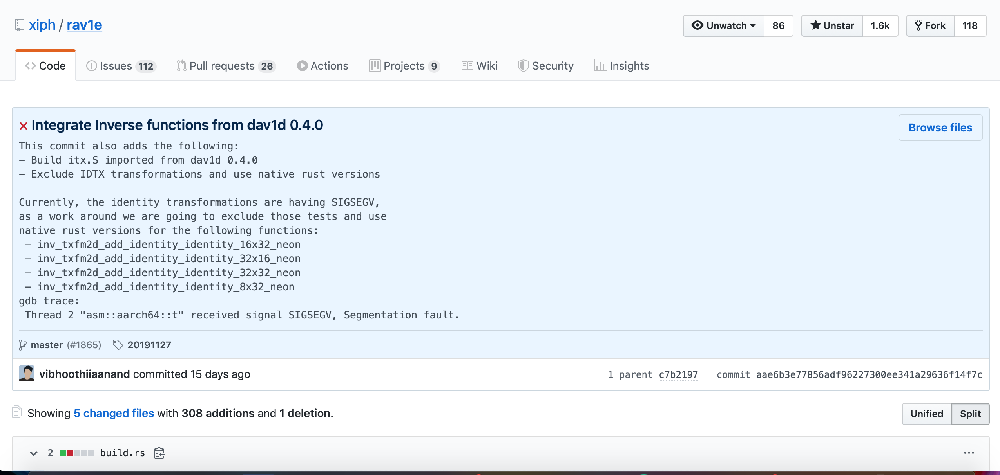
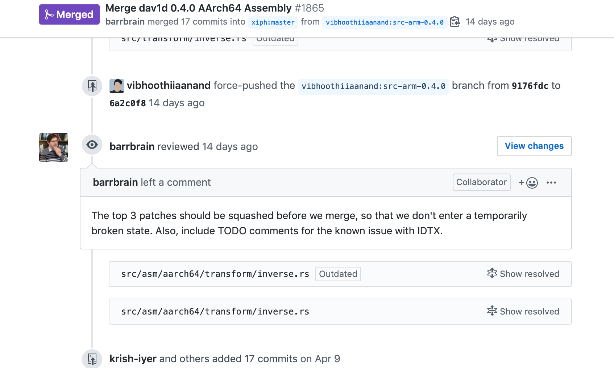
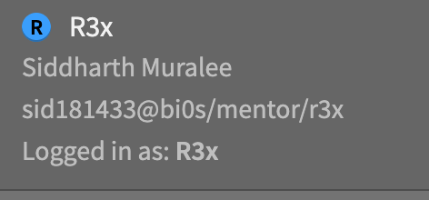
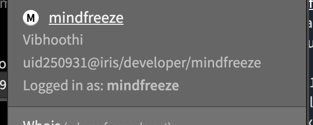

---
false
marp: true
theme: uncover
paginate: true
_paginate: false
---

# <!--fit-->  How to have a proper commit message !!!

## Vibhoothi
### amFOSS 2016_2020
\
Email: vibhoothiiaanand@gmail.com
IRC: `@mindfreeze`
https://mindfreeze.videolan.me
Slides: https://github.com/vibhoothiiaanand/amfoss

---
# Who am I ?

- Lately into Video Compression Technology.
- Hacks with rav1e, the AV1 Encoder.
- Rarely Hacks cone (VLC).
- Tries to write Alien languges like Objective-C, Rust, Assembly.
- Been part of amFOSS from S2
- Famous for being ridicuously rude and sometimes good :v 
<!-- paginate: true -->

---

# Why this ? 

- Since people here, doesn't know(including me) to have proper commit message.
- People are lazy.
- Commit message speaks a lot.

---

# How to do ? 

Ok, so how do you do commit ? like this? 

<!-- _footer: "[1]: https://github.com/amfoss/website/commit/622ad29a5ebc03b8af41b21de4c780bc7d9ebe6e" -->

---

# How to do ? 

Or, like this ? 

<!-- _footer: "[2]: https://github.com/amfoss/website/commit/0e0dde1efe2a0e7af9cd1802ad653e9f20de4e00" -->

---

# How to do ? 

Or, like this? 

<!-- _footer: "[3]: https://github.com/amfoss/website/commit/3130d0181ac6724d26187a71d0c12376a9777f0a
" -->

---

# How to do? 

So there is no specific way to have a commit message, it all depends on the org but there are some things which are common for all.

- Use CLI!! 
> Please, do not use WebUI or App for doing it
- Do NOT use `git pull`
> Rebase it, come on!, you are part of amFOSS Club not some random club ( `git rebase -i origin/master`)
- Conventions
> `<module_name>: Add a random file`
> `<blank_line>`
> `This commit adds so and so in a nice 50 words`

---
# How to do? 

- Styling
>  Do not use  __CAPS__ !, please it is shouting, don't make people angry with your commit messages.
> If you need caps do for first word of line.
> Do not put "PERIOD" or "." at the end of subject

- Typos 
> Double and triple check for typos, once it is merged then it is really difficult to correct them.
> Be Aware!

- Break at 72 Chars and not 80
> Try to break the description when it is 72 characters, have extentions for your `vim` for this, ( Do you vim??) 
---
# How to do? 

- Imperative Mood??
> DO NOT USE gerunds or past tense in your subject lines
> `Fixed the life //wrong.v1`
> `Fixing the life //wrong.v2` 
> `Fix the life ///correct.v1`

- Description 
> Describe what was done and why, but not HOW.

- References 
> Mention the issues or PR which the current commit advances or closes!

- Branch names!
> Do not keep random names for your branch, when sending PR, it does matter.

---

# How to do? 

- Split whenver neccessary 
> You SHOULD split your long and big commit into smaller ones, so it makes sense.
- Squash it !!
> Also like you split, squash the commits, please do not make the reviewers do that part.
- Add Co-Authors
> If someone made the commit proper/helped in some bits of code, have them as co-author
> `git commit ammend `
> `Co-authored-by: "Name <email>"`

---
# How to do ?

- I have to mention the file name too, then ?? 

> 

<!-- _footer: "[4]:https://github.com/xiph/rav1e/commit/3f775d07e58ccf20a7bdfc4c7156600e01529cbc" -->

---

# How to do ?

- Long messages ???, It should be concise

> 
---
# Bonus Tips?? Any

- If there are 5 commits in your patchset, make sure that the commit is in order and doesn't break if we do take only one and gives `ERRORs` or `WARNINGs` or `SIGSEGV`.

> 

---

# Bonus Tips?? Any ?

- Make sure, Travis Goes **Green**, before shouting/asking for review

- Wait for _1 Week_ before blaming any org/project for no-response.

- Start using *IRC* since it is not OK to be saying you are in FOSS Community without using IRC. Register handle, messsage me, would give you cloaks for free.
> Cloak???
> 
> 

---

# Questions????

## Ask questions, Be dumb kids!!